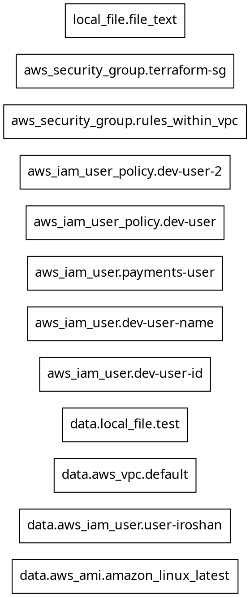

# sre-lab-terraform

- This is following the course terraform-beginner-to-advanced conducted by Zeal Vora from Udemy.
- Do not initialize the project with the backend.tf comment the config for local backend.


## Code Repo

- The link to code repo associated with this course as follows.
    - https://github.com/zealvora/terraform-beginner-to-advanced-resource


## Authentication

- Create a user for the terraform to access AWS services.

- Storing access keys and secrets on the provider block

```terraform
provider "aws" {
    shared_config_files = ["path/to/config"]
    shared_cred_files   = ["path/to/creds"]
    profile             = "custom"
}
```

- If these were not defined, by default aws provider will check for the following paths;
> On Linux and MacOS
> - @HOME/.aws/config
> - @HOME/.aws/credentials

> On Windows
> - "%USERPROFILE%\\.aws\config"
> - "%USERPROFILE%\\.aws\credentials"

- Provider specific credential / authentication - AWS

```terraform
provider "aws" {
    assume_role {
        role_arn        = "arn:aws:iam::123456789:role/ROLE_NAME"
        session_name    = "SESSION_NAME"
        external_id     = "EXTERNAL_ID"
    }
}
```


## Terraform provider versioning

| Version Number Arguments | Description |
| --------- | ---------|
| `"3.70"` | Explicitly mentioned version |
|`">=1.0"` | Greater than equal to the version |
| `"<=1.0"` | Less than equal to the version |
| `"~>2.0"` | Any version in the 2.X range |
| `">=2.10,<=2.30"` | Any version in between 2.10 and 2.30 |

- When `terraform init` is executed it will check for the dependency lock file _.terraform.lock.hcl_ file where the constraints for the providers are configured when the repo was initialized for the first time.
> - To change this we need to delete the file and re initialize the repo with the changes to the provider constraints.

- Else can execute `terraform init -upgrade` which will update the _.terraform.lock.hcl_ file with new configuration.


## Terraform Settings

```terraform
terraform {}
```
- Can be used to define the following
    - Required Terraform Version
    - Required Provider and Version
    - BackEnd Configuration
    - Experimental Features


## Terraform commands

- `terraform init` initializes the terraform repo and installs the providers.
- `terraform fmt` formats the terraform code base to a alligned code base.
- `terraform plan` plans and shows what're the intended changes to be applied.
- `terraform apply` applies the planned changes.
- `terraform destroy` destroy all the infrastructure created from the code base.

## Terraform Apply

- `terrafome apply -auto-approve` will auto approve the apply and no need for manula interactions for applying changes.

### Terraform Destroy

- `terraform destroy -target aws_instance.iroshanv-devops-srelab-ec2` this will only destroy the target instance.


## Desired and Current State

- Desired state is the state defined in the terraform code.
- Current state is the state of the infrastructure. This may not be always equal to the desired state
- As manual interventions can happen, the current state could have been changed.
- Once the terraform apply is executed again, the current state will be changed to the desired state.

> - Desired state is defined as the code we have declared in the repo. If there's only ami and instance_type is declared, the security group is not a desired value.
> - Therefore, whenever declaring resources should declare every aspect of that particular resource.


## Terraform refresh

- `terraform refresh` is used to update the state file about the current state of the deployed infrastructure.
- When executing plan / apply this will be executed automatically no need to explicitly execute it everytime.
- This is dangerous to execute cause it could empty out the tfstate file completely.
- In newer versions `-refresh-only` option can be run since `refresh` has been deprecated.


## Attributes

- Are the fields in a resource that holds the values that ends up in the state.
- In the resource documents attributes of that particular resource block can be found at the end.
- Easy to find in the state file.
- *`resource.resource_name.attribute`* is the convention used.

> - In _cross resource attribute referencing_, terraform will automatically understands the order of resources should be created.


## Output Values

- The values will be made available to the terminal window and expose them so other terraform configurations can use them.
- Modules use output values when exporting data

```terraform
module "module_name" {
    source = "path/to/module"
}
```


## Terraform output

- Can use this command to fetch values for output blocks.
- `terraform output <output_name>`


## Variables

- Static values can be stored as variable where repeatedly apply in the code.


### Declaring in variables file

- Default tfvars file name is _terraform.tfvars_ no need to mention the file name, terraform will automatically load values from it.


### Declaring environment specific variables

- Maintain *.tfvars files for multiple environments.
- When executing terraform command for plan/apply `terraform plan -var-file="prod.tfvars"` used to define which tfvars to be used here.
- In variables if we have configured a default value, it'll only be used if we haven't explicitly configured an enviranment specific value for the variable.


### Declaring variables in CLI

- If we havn't declared a value for a variable, terraform will ask to enter a value when plan / apply is being executed.
- `terraform plan -var="instance_type=m5.large"` this way, terraform won't prompt to ask for undeclared variables.


### Environment Variables

- `TF_VAR_variable` This is the standard env variables in Terraform. For _instance\_type_ variable it should be `TF_VAR_instance_type`

> In linux `printenv` will print all the env variables
>   - `export TF_VAR_instance_type=m5.large`

> In Windows `echo $env:path` `echo $env:JAVA_PATH`
>   - In case the environment variable label contains characters otherwise interpreted as bareword token terminators (like `.` or `-` or ` `), qualify the variable path expression with {...}:
>>  `${env:MINISHIFT-USERNAME}`
>   - Can also enumerate all variables via the `env` drive:
>>  `Get-ChildItem env:`


### Variable definition Precedence

- Terraform loads variables in the following order highest precedence will be the first one
    - -var / -var-file options on the cli.
    - *.auto.tfvars / *.auto.tfvars.json processed in lexical order
    - terraform.tfvars.json
    - terraform.tfvars
    - Environment variables
> The default values assigned when variables are declared will always be overridden if any of the above type exists.


## Data Types

- Can restrict variable value to Data Type. 
- `type=` is used to restrict the value type.
>   The error will be `Error: Invalid value for input variable`
- Even attributes has value types. Can be seen in the argument references.
- List type can have one or multiple values at a time. has squre brackets.
    - For list, can restrict the type of values to be included in lists.
    >    `type = list(number)` \-\> list = ["1","2","3"]

- Map type has key value pairs and has curly brackets.

- Set type has curly brackets.
- Used to store multiple items, similar to list. Items are unordered and duplicates are not allowed.
- `toset()` will convert a list into a set, removing duplicates if present.
> In `for_each` sets will be used for distinct values.


### Fetching / Referencing data from Maps and Lists


## Conditional Expressions

- _condition ? true\_value : false\_value_ - similar to if conditions


## Functions

- Built-in Functions :- which are already defined in the framework itself.
- Can be used to farious functions to be executed within the Terraform code.
- Terraform doesn't support user defined functions.


## Local Values

- Locals are used to centrally store common data.
- In a sense similar to variables, but can do more in locals.
- But in locals can add expressions, which allows you to compute values dynamically.


## Data Sources

- Allow Terraform to use / fetch info defined outside of Terraform
- When using data sources, always refere to the documentation.


### Filters

- Used to filter out a specific or a group of recources to be used by data resources.
 

## Debugging Terraform

- Has detailed logs that can be enabled by setting the **TF_LOG** env variable to any value.
- you can set the variable to one of the below log levels (in order of decreasing verbosity).
- Linux: `export TF_LOG=INFO`
- Windows: `set TF_LOG=INFO` - This will only be set to the session (temparory).

|**Log Level**|
|-----------|
|TRACE|
|DEBUG|
|INFO|
|WARN|
|ERROR|

- Can set the log file path by configuring **TF_LOG_PATH**.
- By default log will be printed in std out.
- After setting the verbose logging will be re-directed to the file in the log path.


## Terraform Troubleshooting

- Four potential types of error could be occured.
    - language: HCL - Hashicorp Configuration Language
    - State: state locks happen when state is out of sync: for this you can `terraform force-unlock LOCK_ID`
    - Core: Terraform bugs
    - Provider: The provider related issues


## Dynamic Blocks

- Dynamic blocks allows us to dynamically construct repeatable nested blocks which is supported inside the following blocks;
    - resource
    - data
    - provider
    - provisioner

```terraform
dynamic "example" {
    
}
```


## Terraform Validate

- Used to validate the configuration files


## Terraform Format

- Used to format the configuration files in to a more ordered and justified manner.


## Terraform Taint

- Cloud resource can be managed by the terraform or using other resources (cdk / manual), if a tf managed resource has been altered manually, then we can use tainting to replace or delete / recreate the resource.
- `terraform apply -replace="aws_instance.secondary-instance"`
- Terraform will destroy and create a new instance.
- Previously in older versions there was a command `terraform taint` now this command is not recomended to use.


## Terraform Target

- To plan / apply only a specific resource can use `-target`.
    - `terraform plan -target="aws_security_group.rules_within_vpc" -var-file=dev.tfvars`
    - `terraform plan -target aws_iam_user.dev-user-name -var-file=dev.tfvars`


## Splat Expressions

- Allows to get a list of all the attributes.
- Can be used to get a list of all the elements created from a resource; if the count is declared.
- Attributes:
    - arn
    - name
    - unique_id
- Using \[\*\] with the resource name will list all the elements.


## Terraform Graph

- Can create a dependency graph using `terraform graph`.
- For this you don''t need to specify an env file, this will only run the dependency check and create a DaC (Diagram as Code).
- https://dreampuf.github.io/GraphvizOnline/
- This is using [Graphviz](https://graphviz.org/) dot language to generate a machine readble graph code.
- If Graphviz dot engine is installed, can use `terraform graph -type=plan | dot -Tpng > graph.png`
- `terraform graph -type=plan | dot -Tsvg > graph.svg`




## Save the plan to a file

- Allows saving a plan to a file.
- `terraform plan -out infra.plan -var-file=dev.tfvars`
- If we change the configurations later and we only need to run the previous configurations, this plan out gives us the opportunity to save this plan.
- Many organizations require proof of planned changes for change management proccesses; this -out is the best way to provide what they reqire.
- `terraform apply infra.plan`
- `terraform show infra.plan` will show us the content.
    - `terraform show -json infra.plan` will give the json output.


## Managing large infrastructure

### Service Quotas

- Some services have service quotas: some are adjustable and others fixed.

### API Throttling

- Need to keep API throttling in mind, when the allotted rate limit for an API call is exceeded, will receive an error.
- If the rate limit is 1000, and a two calls one is 1000 and other 10, the 10 call will be throttled.
- If the project has a large amount of resources; we need to be mindful about the way we are running plan / apply, cause it will send multiple API calls, even to refresh the state.
- CIS benchmark document contains all the details regarding rules to follow.
- This could affect production environment.

### Key considerations

- Convert a Big project into Multiple Smaller Projects.

|Project|Resources|
|-----|-----|
|Project-1|vpc|
|Project-2|iam_resources|
|Project-3|ec2_instances|

- Use resource targetting. `terraform plan -target="<target_resource>" -var-file=<variable_file>`

- Setting refresh=false; this will stop the state refreshing which will stop sending lots of api calls for checking the current state of the infrastructure. This should only be done if you are sure about the current state.
    - `terraform plan -refresh=false -var-file=dev.tfvars`


## Zipmap function

- Construct a map from a list of keys and the corresponding list of values.
- `zipmap(["a","b"], [1,2])`
    - {
        "a" = 1,
        "b" = 2
    }


## Comments

- HCL supports three different syntaxes.

| Type | Description |
|------|-----|
| # | single-line comment, ending at the line end |
| // | single-line comment, alternative to # |
| /* and */ | multi-line comments delimiters for start and end |


## Resource behaviour & Meta arguments

- Terraform will create a resource that exist in the configuration but not in the state file.
- Terraform will destroy resources that exist in the state but no longer exist in the configuration file.
- Update in-place resources whose arguments have changed.
- Destroy and re-create resources whose arguments have changed but which cannot be updated in-place due to remote API limitation.
    - AMI id changes
    - EC2 instance type changes

- So the default behaviour is to always check and compare the desired state and the current state. But if we have changed the current state by altering manually, need to tell terraform to ignore those manual changes and let them be there.


### Using Meta Arguments

- Terraform allows us to include meta-argument within the resource block which allows some details of this standard resource behavior to be customized on a per-resource basis.

| Meta-Argument | Description |
|-----------|---------|
| depends_on | Handle hidden resource or module dependecies that Terraform cannot automatically infer. |
| count | Accepts a whole number, and creates that many instances of the resource |
| for_each | Accepts a map or set of strings, and creates an instance for each item in that map or set. |
| lifecycle | Allows modification of the resouce lifecycle. |
| provider | Specifies which provider configuration to use for a resource, overriding Terraform's default behavior of selecting one based on the resource type name |


- There are 4 arguments available within lifecycle block.

| Arguments | Description |
|-----------|----------|
| create_before_destroy | New replacement object is created first, and the prior object is destroyed after the replacement is created. |
| prevent_destroy | Terraform to reject with an error any plan that would destroy the infra onject associated with the resource. |
| ignore_changes | Ignore certain changes to the live resource that does not match the configuration. |
| replace_triggered_by | Replaces the resource when any of the referenced items change. |

- There are few limitations when using `create_before_destroy` cannot use if a ip is set in the configuration.
- `prevent_destroy` can be used as a safety measure against the accidental replacement of objects that may be costly to reproduce, such as database instances; but if the resource block was removed from the configuration, then it will be destroyed.
- `ignore_changes` can be used to ignore the modifications done on a resource outside of the terraform, best option to keep the changes done by a customer on a resource created by an automated process.
    - Can add multiple attributes.
    - `all` every change done after creation of the resource will be ignored.
- Terraform will destroy if destroy is executed but will not update it.


## COUNT Meta-Argument

- Used to create the identical resources repeatedly (multiple), example 30 ec2 instances.
- Not restricted to ec2, but other resources as well.
- Depending on the amount of resources being created, it might be hard to handle the instances. Hence will need some level of customizations.
- Some resources have uniqueness in their resources and, need to have a unique identifier/name.


### COUNT.INDEX

- `count.index` holds a distinct index number, starting from 0.
- Each resource will have a unique index.


### Challenges

- for list `default = ["user-1", "user-2", "user-3"]`
- count `count = 3` & `count.index`
- At this if we changed the order of the list, the resource mappings will be changed, cause the positions will be changed.
- If resources are almost identical, `count` is appropriate.
- If distinctive values are needed in the arguments, usage of `for_each` is recomended.


## for_each Meta-Argument

- Makes use of map/set as an index value of the created resource.
- Since it will be using the key instead of an index for resource referencing, if a new element is added, it will not affect the other resources.
- Has two attributes each.key & each.value.

```terraform
for_each = {
    key1 = "t2.micro"
    key2 = "t3.micro"
}

key_name = each.key
instance_type = each.value
```


## Provisioners

- Used to **execute scripts** on a local or remote machine after resource creation or destruction.
- Ex: Install software packages after launching an instance.
- There are 2 major types of provisioners.
    - local-exec
    - remote-exec
    > - file provisioner: not included in the exam.

- Provisioners need to be defined inside the resource block.
- For multiple commands need to configure multiple provisioners.

### local-exec provisioner

- Invokes a local executable after a resource is created.
- Ex: EC2 is launched and fetch the IP and store it in a file *server_ip.txt* in the local server where the Terraform is istalled.


### remote-exec provisioner

- Invoke scripts or run commands directly on the remote server.
- Ex: Install nginx, apache after EC2 is launched.
- For this we need to have the key file to access the server. (Store the key in a secure manner. They key is ignored.)
- The key file content should be loaded into the terraform and can be done using `file(./key/path)` function.
- Need to configure & specify the connection details.
- The security group being attached need to have the ssh rule allowed.


### Creation-time provisioners

- Only run during creation, not during updating or any other lifecycle.
- If a creation-time provisioner fails, the resource is marked as tainted (to be replaced).
- A tainted resource will be planned for destruction and re-creation upon the next terraform apply.
- Terraform does this because a failed provisioner can leave a resource in a semi-configured state.
> If a provisioner failed, `on_failure` condition can be used to change the default behaviour which is to fail the terraform apply it self.

| Allowed Values | Description |
|------|---------|
| continue | Igonore the error and continue with creation or destruction. |
| fail | Raise an error and stop applying (the default behaviour). If this is a creation provisioner, taint the resource. |


### Destroy-time provisioners

- Only run before the resources are destroyed.
- Commonly used when remove and De-link Anti-Virus software before EC2 gets terminated.


## Terraform Modules

- One of the basic principle of SE is DRY. Stop repititive patterns.
- With a larger organization, there can be lots of instances where can be the same code will be used 100+ times. In a situation such as this, there can be issues if we try to attach a new feature or try to change anything.
- For ease of use and maintenance we can try to modularize repetitive code patterns.
- Better approach is to use centralized standardized terraform templates/modules.

```terraform
module "ec2_instance" {
  # using the module to import the variable outputs
  source = "path/to/outputs"
}
```

- Advantage is that, no need to write code starting from scratch. Already available modules can be imported to make things easier.
- [AWS modules](https://github.com/terraform-aws-modules/)
    - ec2_module
    - vpc_module
    - iam_module

- Modules can be found in the following location (provider is selected as AWS)
    - https://registry.terraform.io/browse/modules?provider=aws

- Just by referencing any module, it is not always the case that the infrastructure resource will be created for you directly.
- Some modules require specific inputs and values from the user side to be filled in before a resource gets created.
    - [eks module](https://registry.terraform.io/modules/terraform-aws-modules/eks/aws/latest)
    - Here needs to give the subnet id of the AWS account.

```terraform
module "eks" {
  source        = "terraform-aws-modules/eks/aws"
  version       = "20.24.2"
  subnet_ids    = [sub_net_id_list]
  cluster_name  = "a_name_for_the_cluster"
}
```


### Module Structure

- Some module pages in GitHub can contain multiple sets of modules together for different features.
- In such cases, you have to reference the exact sub-module required.
    - "terraform-aws-iam/modules/iam-account"
    - "terraform-aws-iam/modules/iam-assumable-role-with-oidc"
    - "terraform-aws-iam/modules/iam-assumable-role-with-saml"
- Always read the Module Documentation to understand the overall structure, important information, and the expected input when creating a resource.


### Correct Module

- The registry can contain multiple modules for a specific infrastructure.
    1. Check total downloads
    2. Check GitHub page of module
    3. Avoid modules written by individual participant
    4. Analyze module documentation
    5. Check version history of module
    6. Analyze the code
    7. Community feedback
    8. Maintained by HashiCorp partner

> [!CAUTION]
> An attacker can include malicious code in a module that sends information about environment to the attacker.

> [!IMPORTANT]
> Organizations maintain their own set of modules.
> Might have initially fork a module from the Terraform registry and modify it.


## Creating a custom module

### Standard module structure

- It is a bundle, can be one or multiple tf files where the necessary inputs are exposed with outputs.tf file.
- There's a minimal file standard structure to be maintained.

> - minimal-module/
>   -   ├── README.md
>   -   ├── main.tf
>   -   ├── variables.tf
>   -   └── outputs.tf

> - complete-module/
>   -   ├── README.md
>   -   ├── main.tf
>   -   ├── variables.tf
>   -   ├── outputs.tf
>   -   ├── ...
>   -   ├── modules/
>       -   ├── nestedA/
>           -   ├── README.tf
>           -   ├── main.tf
>           -   ├── variable.tf
>           -   └── outputs.tf
>       -   ├── nestedB/
>       -   ├── .../
>   -   ├── examples/
>      -    ├── exampleA/
>           -    ├── main.tf
>      -    ├── exampleB/
>      -    ├── .../

- There can be additional files.
- Depending on the consumer's requrements, the production team will break up the applicatio infrastructure into smaller modules representing the services.


### Module sources

- GitHub urls
    - Referenced with `"github.com/path/to/module"` for https urls.
    - `"git@github.com:path/to/module"` for ssh.
- Generic git urls
    - `"git::https://"` & `"git::ssh://"`
- HTTP Urls
    - `<meta name="terraform-get" content="github.com/path" />`
- S3 Buckets
- Terraform registry
- Local paths
    - A local path must begin with either ./ or ../ to indicate that it's a local path

- For more sourcing methods refer the [documentation](https://developer.hashicorp.com/terraform/language/modules/sources). 


### Improving a module

- Need to get rid of the hardcoded modules. 
- If there are hardcoded values we cannot edit them after importing a module.
- Try to add a required_provider block if there are version specific configurations in the code.


### Variables in modules

- In order to avoid the hardcoded values, use of variables is a good approach.


### Root & Child Module

- Root module resides in the main working directory of your Terraform config. This is the entry point for your infra definition.
- A module that has been called by another module is often referred to as a child module.

```terraform
module "ec2_instance" {
  # root module to import the child module
  source = "path/to/other/modules"
  # the module which is being called is the child module
}
```


## Publishing modules

- There are certain requirements.
    - GitHub : The module must be on GitHub and should be a public repo.
    - Named : Repo must follow the three-part convention
        - `terraform-<provider>-<name>`
    - Description : Used to populate the short description of the repo.
    - Module structure : Must adhere to the standard module structure.
    - Version tags : Must be semantic versioning (x.y.z) and can be optionally prefix with v.


## Terraform Workspace

- Terraform workspace enable us to manage multiple set of deployments from the same sets of configuration file.
- Unique tfstate file created for each environment workspace for the same set of configs.
    - dev.tfstate ----> Development ENV
    - prod.tfstate ----> Production ENV

- `terraform workspace list` shows the list of workspaces available.
- `terraform workspace select <workspace_name>` swith to the dev env workspace.

- Depending on the workspace we can define the variables to be associated with deferent values.

| Environement | instance_type |
| ----- | ----- |
| Dev | t2.micro |
| Prod | m5.large |

```terraform
resource "aws" {
    ami             = "ami-4d8afes5g3sg354s"
    instance_type   = local.instance_type[terraform.workspace]
}
```


## Remote TFState management

- When commiting the work repo to better to avoid, secrets, credentials and key files if used in the repo it self.
- Use a vault or secrets manager for passwords and secrets to be stored.
- The terraform.tfstate files can include passwords in clear texts.
- terraform.tfvars which could contain passwords (optional) & crash.log file if terraform crashes, could be commited to the remote repo, it's better to omit them in gitignore as well.


### Terraform state management

- It is not recommended to modify the state file manually. But there are cases where you might have to modify the state file manually.
- Terraform state file management commands; `terraform state`

| Sub-commands | Description |
| ----- | ----- |
| `list` | List resources within terraform state file |
| `mv` | Moves item with terraform state |
| `pull` | Manually download and output the state from remote state |
| `push` | Manually upload a local state file to remote state |
| `rm` | Removes items from the Terraform state |
| `show` | Show the attributes of a single resource in the state |
| `replace-provider` | Used to replace the provider for resources in a Terraform state |


## Terraform Backend

- Backend determines where the terraform stores it's state file.
- By default it uses a backend called local to store the state on the disk.
- Storing state file in a remote repo is not ideal if the source files are used by a collabarative team.
- Recomennded architecture is to store the source files as follows,
    - Code is stored in Git Repo.
    - State file is stored in a central backend.
        - S3
        - Consul
        - Azurerm
        - Kubernetes
        - HTTP
        - ETCD


### Configuring backend in S3

- The backend is configured using the `backend` keyword.
- The bucket needs to be created beforehand to store the file.
- We can use this configuration to customize the storing location depending on the project you are working and the statefile name as well.
- This can be implemented to set the backend dynamically, if there's a terraform template is used.
- In this we can use the `terraform init` command to set the backend configurations, [Partial Configuration](https://stackoverflow.com/questions/63048738/how-to-declare-variables-for-s3-backend-in-terraform).
    - Import the backend from env variables.

        ```shell
        terraform init \
        -backend-config="bucket=${TFSTATE_BUCKET}" \
        -backend-config="key=${TFSTATE_KEY}" \
        -backend-config="region=${TFSTATE_REGION}" 
        ```

    - Import the backend config from a file
        - Create a .conf file
        ```
        bucket="terraform-state-bucket"
        key="path/<state_file_name>.tfstate"
        region="aws-region"
        ```

        ```shell
        terraform init -backend-config=dev.conf
        ```


> [!IMPORTANT]
> As per the backend design here, the `TFSTATE_KEY` should be defined explicitly otherwise it would give an error, cause the default value would overwrite an existing statefile. This is cosidered if you are using multiple statefiles to be stored in tha same bucket or under the same project instaces such as network, security, core, resources, etc..


### Configuring to set the local path dynamically

- This is help full if the state files are centralized according to resources, if the account management is hard to maintain in buckets.

```terraform
# local backend config (used to set backend dynamically)
data "terraform_remote_state" "foo" {
  backend = "local"

  config = {
    path = "${path.module}/../../${terraform_file_name}.tfstate"
  }
}
```


## State Locking

- This is done as a fail safe to stop from running multiple `terraform plan/apply` commands simultaneously.
- If not, the state file will be corrupted. 
- If an error is thrown then someone else is performing `terraform plan/apply` operation.
- State locking happens automatically and able to see `terraform.tfstate.lock.info` file is created. This file contains all the details of the currently running operation. This file will be removed once the operation is completed.
- If state locking is failed, terraform will not continue.
- Not all backends support locking (makesure the backend supports state locking if it's a collaborative project).
- Terraform has a `force-unlock` feature to unlock the state, if the state lock has not been removed automatically.

> [!CAUTION]
>  This should be used to remove your own terraform locking. Not for someone else's locking operation.


### State locking with DynamoDB

- By default S3 does not suppport State locking functionality.
- You need to make use of DynamoDB table to achive state locking functionality.
- When creating the DDB table the partition key must be `LockID` with _String_.
- When the changes are done and initialize again in a previously initialized project,
    - `terraform init -migrate-state` to change the state locking.
    - `terraform init -reconfigure` to keep it as it is with no changes.


## Remote state data source

- In large organizations multiple teams work on different aspects of the infrastructure resources.
    - Networking team: Public IPs, vpc creation, peering
    - Security team: Firewall rules, shield, certificate management
    - Application team: Instance creation, lambda functions, parameter store, secret manager, ECS/EKS

- In a situation like this, the security team needs to know the IPs the networking team is creating, so that they can whitelist them.
- In order to achieve this, following steps must be fulfilled.
    - The code from the Sec project should have access to tfstate file of Networking project.
        - The Networking project s3 bucket should be accessible by the Sec project code.
    - The code should fetch all the address mentioned in the output values in the state file.
    - The code should whitelist the IP addresses in Firewall rules.
- There can be multiple dependencies which can be managed by n number of teams.

> - networking-project/
>   -   ├── backend.tf
>   -   ├── eip.tf
>   -   ├── variables.tf
>   -   └── outputs.tf

> - security-project/
>   -   ├── backend.tf
>   -   ├── firewall.tf
>   -   ├── variables.tf
>   -   └── outputs.tf

- The `terraform_remote_state` data source allows to fetch output values from a specific state backend.

```terraform
data "terraform_remote_state" "eip" {
    backend = "s3"
    config = {
        bucket  = "terraform-state-files"
        key     = "networking-state-folder/eip.tfstate"
        region  = "us-east-1"
    }
}
```

- In the code the resource should be defined to fetch the data.
```terraform
resource "aws_vpc_security_group_ingress_rule" "allow-eip" {
  security_group_id = aws_security_group.terraform-sg.id
  ip_protocol       = "tcp"
  cidr_ipv4         = "${data.terraform_remote_state.eip.outputs.eip_addr}/32" # string interpolation
  /* the eip of the created resource has been used here
  */
  from_port = 7000                           # starting port
  to_port   = 7010                           # ending port
}
```


## Terraform import

- If there are resources created manually and now need to manage them under terraform, can use the `terraform import` to bring the previously manually created resources to terraform.
- In earlier versions of terraform the user had to still create the tf files from scratch before importing the resources to _terraform.tfstate_ file.
- In the newer approach, `terraform import` can automatically create the terraform configuration files for the resources you want to import.
- This is much easier when there are large number of resources to be imported to terraform.
\
&nbsp;
- First approach; the configuration files are present, but the resources are not in state file
- Can find a guide from [here](https://spacelift.io/blog/importing-exisiting-infrastructure-into-terraform).
- This is important when you are missing the state file.

```shell
terraform import <resource_type><local_name>
```
- Second approach is to import resource using an [import block](https://developer.hashicorp.com/terraform/language/import).
- This is important when there are a large number of unamanged resources available can be used to bring under terraform management.
\
&nbsp;
- After creating the import block you can generate the [configuration](https://developer.hashicorp.com/terraform/language/import/generating-configuration) file.

```shell
terraform plan -generate-config-out=generated.tf
```


## Multiple Provider Configuration

- There can be instances where a single config file can contain resources which need to be deployed to different regions.
- Can utilize the alias meta-argument in the provider block.
- Even in multiple provider you need to define unique local name for resource names.
- [multi-provider.tf](./multi-provider.tf)


## Sensitive Parameters

- Should design our terraform configs in such way that sensitive information is available and shown out of the box std_out, logs, etc..
- For sensitive content in creating files can use the sensitive parameter with the content or the `local_sensitive_file` resource type.
- [file.tf](./file.tf)
- Sensitive content cannot be viewed through terraform output blocks; trying will immediately give an error.
> Error: Output refers to senstive values
- If the content to be censored; then use the `sensitive = "true"` attribute within the output block.
- But the sensitive info will be included in the tfstate file.

> [!IMPORTANT]
> Mature providers like AWS has a way to identify that there are sensitive information in the resource blocks.
> RDS or DB instance creation could include passwords and they will be redacted automatically, even if we didn't configure the sensitive parameter.


## Hashicorp vault

- HashiCorp Vault allows organizations to securely store secrets like tokens, passwords, certificates along with access management for protecting secrets.
- One of the common challenges nowadays in an organization is "Secrets Management". Ex: db passwords, access/secret keys, API tokens, encryption keys etc...
- Vault can be used to rotate secrets which will prevent breaches and secret leaks.
- Vault has dynamic secrets; where a unique secret is generated for the user and it'll be expired after a TTL.
- Vault can be used to encrypt data.
- Access management related work can be overtaken by Vault.


## Terraform and Vault integration

- Vault provider allows Terraform to read from, write to, and configure HashiCorp Vault.
- [vault.tf](./vault.tf)
- Any vault secrets obtained using Terraform will be present in the state file, make sure to securly store the state file.


## Dependency Lock file

- Provider plugins and Terraform are managed independently and have different release cycle.
- Version constraints within the configuration itself determine which versions of dependecies are potentially compatible.
- When installing a provider for the first time, terraform will pre-populate the hashes value with checksums that are covered by the provider developer's cryptographic signature, which usually covers all of the available packages for that provider version across all supported platforms.

> [!IMPORTANT]
> Terraform does not remember version selections for remote modules, and so Terraform will always select the newest available module version that meets the specified version constraints.


## HCP Terraform Cloud

- Can create a free [account](https://app.terraform.io/session).
- In the *Free Tier* can use upto 500 resources per month. [For more](https://www.hashicorp.com/products/terraform/pricing).
- Basic structure of HCP Terraform.
    1. Organizations - Oraganizations are shared spaces for one or more teams to collaborate on workspaces.
        - HCP manages plans and billing at the organization level.
        - Each user can belong to multiple orgs, which might subscribe to different billing plans.
    2. Workspace - Manages infrastructure with workspaces instead of directories.
        - An org can have multiple workspaces.
        - The workspace doesn't contain the tf configuration files, instead it links to the appropriated git repo and fetch the code to execute.

    | Component | Local | HCP Terraform |
    | ----- | ----- | ----- |
    | tf configuration | On disk | In linked git repo |
    | Variables | `.tfvars` files, CLI arguments, shell env variables | In workspace |
    | State | On disk, remote backend | In workspace |
    | Secrets, creds | shell env variables, entered at prompts | In workspace, as sensitive variables |

    3. Projects - Helps to organize your workspaces into groups.
        - A project can have multiple workspaces associated.
        - Can structure your projects based on the org resource usage, teams, business units, services etc.
        - In *Standard Edition* can grant teams access to groups/projects.
    4. Registry - Can store modules in the private registry.
